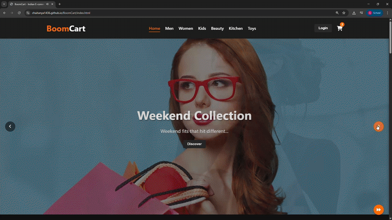

### 🛒 BoomCart E-commerce Website - Current Functionality

# 🛒 BoomCart

**BoomCart** is a stylish, fully functional eCommerce web app built using HTML, CSS, and JavaScript. It features a dark-themed design, interactive UI, seamless shopping flow, and a secure admin panel.

## 🌐 Live Website
[Click here to visit BoomCart](https://chaitanya1436.github.io/BoomCart/index.html)

  

---

## 🎯 Website Flow

### 👤 User's Point of View

#### 🔥 Homepage Experience
- Dark-themed UI with orange highlights
- Random background music plays automatically
- Hero carousel rotates shopping visuals every 5 seconds
- Product sections:
  - Men's Clothes
  - Women's Clothes
  - Kids' Clothes
  - Beauty Products
  - Kitchen Items
  - Toys
  - Three locked sections for upcoming sponsors
- "View All" buttons in each category

#### 🛍️ Browsing & Shopping
- Clickable product cards with detailed view
- Prices show original (strikethrough) and current
- Hover effects with glowing orange shadows and zoom animation
- Add to Cart from anywhere (category or detail view)
- Real-time cart updates with total calculation

#### 🧾 Cart & Checkout
- Cart sidebar with all selected items
- Modify quantities or remove items directly
- Checkout modal collects:
  - Full Name
  - 10-digit Mobile Number
  - Full Delivery Address
  - UPI Transaction ID (after payment to `8919255311@ibl`)
- Input validation and order confirmation message

#### 🔐 Authentication
- Custom login/register system (no Google OAuth)
- Login not required to shop, but useful for order tracking

#### 💡 UX Features
- Continuous music across pages
- Cart clears on exit (non-persistent)
- Fully responsive (mobile, tablet, desktop)
- Category-specific product pages

---

### 🛠️ Admin's Point of View

#### 🔑 Admin Login
- **Username:** `admin`
- **Password:** `admin123`
- **Email:** `sayboomcart@gmail.com`

#### 📊 Admin Dashboard
- View statistics: Pending, Approved, Rejected orders

#### 📋 Order Management
- Tabs to filter: All, Pending, Approved, Rejected
- Each order shows:
  - Order ID
  - Customer info
  - Timestamp
  - Amount & Status
  - Expandable "View Details" with:
    - UPI Transaction ID
    - Delivery Address

#### ✅ Order Actions
- Approve or Reject pending orders only
- Actions update the order status

#### 🧪 Access Control
- Only admin can access dashboard
- Unauthorized users get redirected

---

## 📱 Tech Stack
- HTML
- CSS
- JavaScript (Vanilla)
- No backend/server (static site)

---

## 🚀 Future Plans
- Add sponsor sections
- Store cart & order data persistently
- Email notifications on order update

---

## 📩 Contact
For issues or feedback, reach out to: **chaitanyanagasai143@gmail.com**

---

> Built with 💥 by chaitanyanagasai143@gmail.com

BoomCart is a sleek, black-themed e-commerce platform with vibrant orange accents, built for the Indian market with a focus on UPI payments and a unique shopping vibe enhanced by continuous background music.

---

### 🧑‍💻 User Experience
- 🏠 Homepage with trending products & category selection  
- 🔍 Product browsing with category filtering  
- 📄 Product detail pages with images & information  
- 🔁 Infinite scroll on category pages  
- 🛒 Cart system for adding/removing products  
- 💖 Wishlist functionality to save favorites  
- 🎵 Background music that auto-plays across the site  

---

### 🛍️ Categories & Products
- ✅ **Unlocked Categories**: Clothes, Beauty & Personal Care  
- 🔒 **Locked Categories**: Section 1, 2, 3 (with sponsor message)  
- 🖼️ Product listing with images, names, prices, ratings  
- 🧮 Product filtering & sorting options  

---

### 🔐 Authentication
- 🔓 Google-based authentication system  
- 🙋 User profile with personal information  

---

### 📦 Shopping Experience
- 🛒 Cart management  
- 🚚 Checkout with shipping info  
- 📍 Indian address validation  
- 🏦 UPI payment system with QR generation  
- 🔢 Transaction ID entry for verification  
- 📦 Order status tracking for users  

---

### 🛠️ Admin Functionality
- 🧑‍💼 Admin dashboard at `/admin`  
- 🔐 Admin login (store manager: `sayboomcart@gmail.com`)  
- 📑 Order management system  
- ✅ Payment verification interface  
- 🚚 Update order statuses (Processing, Shipped, Delivered)  
- ⏳ Overview of pending verifications  

---

### ⚙️ Technical Features
- 📱 Responsive design for all devices  
- 🗃️ PostgreSQL database integration  
- 🔐 Secure auth & protected routes  
- 💰 Indian Rupee (INR) currency formatting  

---

BoomCart is a full-fledged Indian e-commerce platform offering a smooth, immersive, and stylish shopping experience tailored for modern users.  
